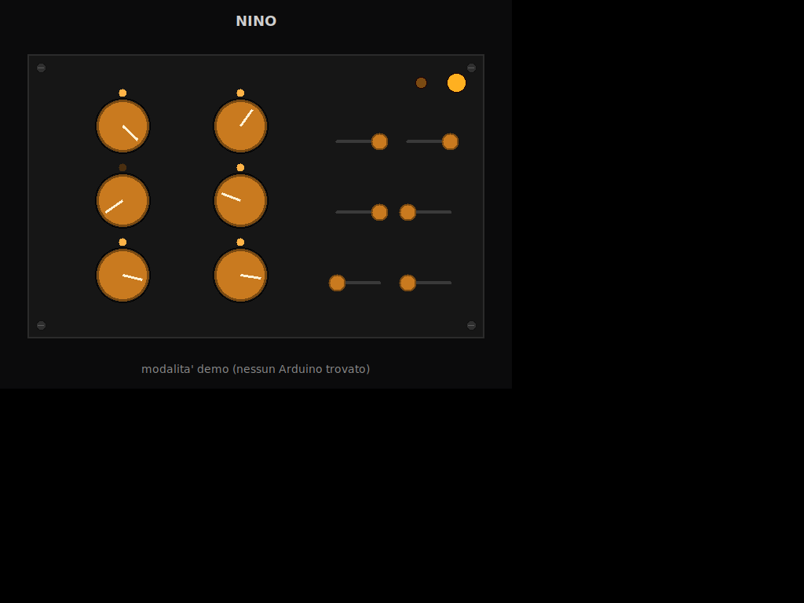

# NINO — Node Interface for Networked Output

Project for the NINO hardware controller (Arduino) connected to audio synthesis/programming environments.

## Graphical interface (demo)

Stylized preview of the Python graphical panel (`mapping_layer`, demo mode, simulated values):

## Structure

- `firmware/` — Arduino sketch for the NINO board.
- `docs/diagrams/` — conceptual and physical diagrams of the system.
- `mapping_layer/` — Python application: reads the serial data and translates it into OSC/MIDI.
- `prototyping/` — standalone native implementations (Max, Csound, SuperCollider) that talk directly to the serial port.

## Requirements

- Arduino IDE (for the firmware in `firmware/`)
- Python 3.9+ (for `mapping_layer/`, see its README)

## Credits

Developed by Anthony Di Furia during the electroacoustic music courses
with maestro Alessandro Fiordelmondo at the Conservatorio di Cesena.
